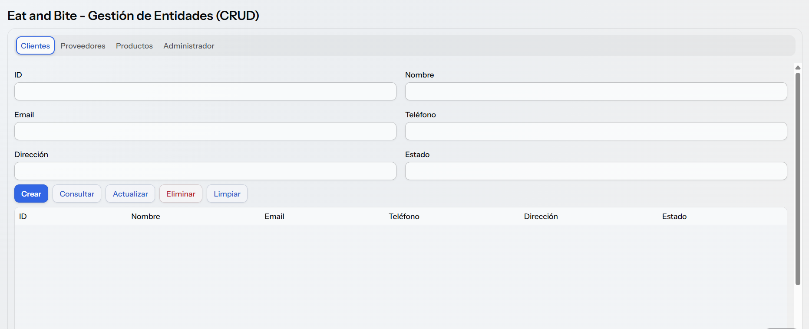

# Eat And Bite - Gestión de Entidades (CRUD)

Gestión de Entidades de Eat And Bite, el cual contiene Clientes, Proveedores, Productos, Cupones y Administrador.

El programa busca que los administradores puedan Crear, Leer, Actualizar y Eliminar datos con mayor facilidad y una interfaz de usuario adecuada. La conexión con una base de datos todavía no está implementada.



## Tecnologías

- Java 25
- Spring Boot 4
- Vaadin 25

## Requisitos

- Java 25 instalado (no hace falta instalar Maven, el proyecto incluye su propio wrapper).

## Inicializar la Gestión de Entidades

Abre una terminal en la carpeta del proyecto y utiliza el siguiente comando.

En Windows (PowerShell):

```powershell
.\mvnw.cmd
```

En Linux, macOS o Git Bash:

```bash
./mvnw
```

Cuando la consola muestre `Started Application`, la página estará disponible en http://localhost:8080. El navegador se abre automáticamente; la primera vez tarda varios minutos porque descarga las dependencias.

Para detener el programa, presiona `Ctrl + C` en la terminal.

## Compilar para producción

Para generar el archivo `.jar` en modo producción, ejecuta:

```bash
./mvnw package
```

Y para arrancarlo:

```bash
java -jar target/app-1.0-SNAPSHOT.jar
```

## Docker

Para crear una imagen Docker, ejecuta:

```bash
docker build -t eat-and-bite:latest .
```

## Integrantes

- Samuel
- Michell
- Andrey
